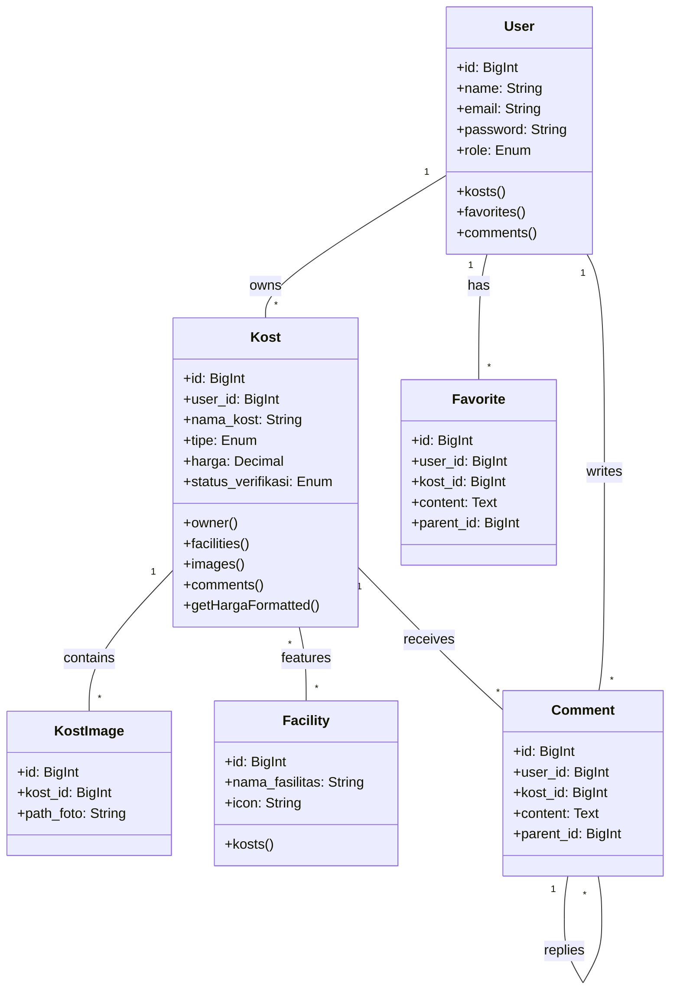
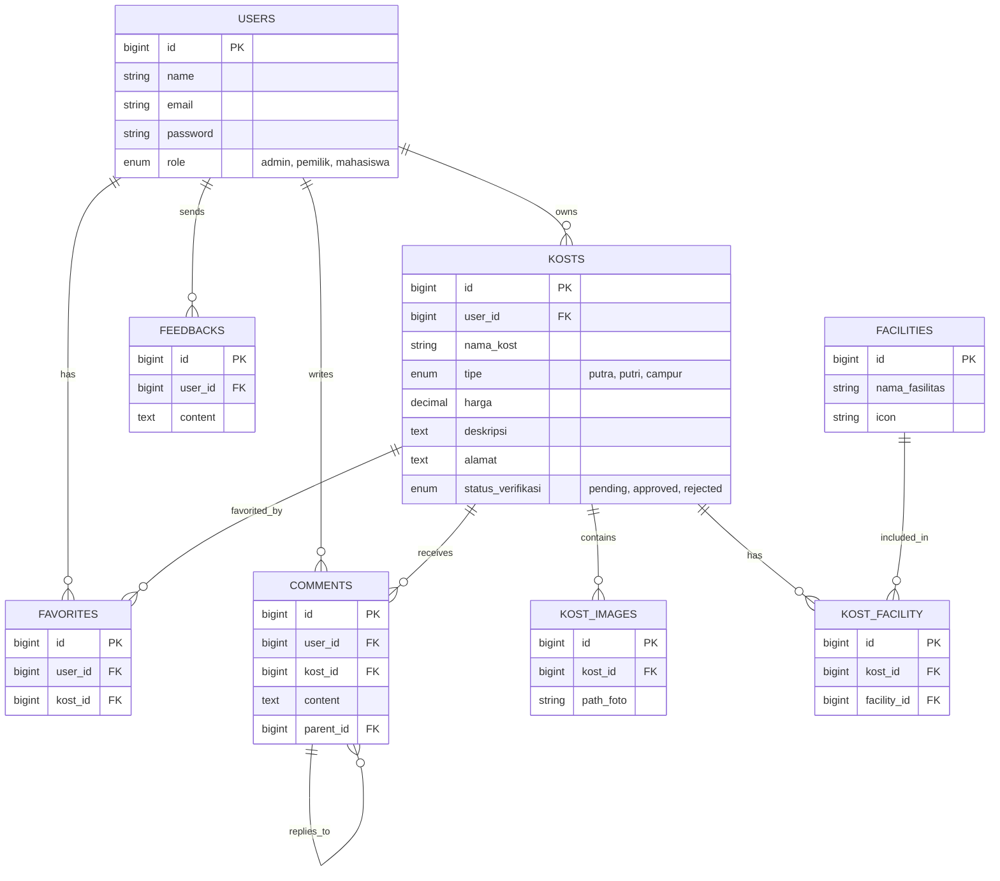
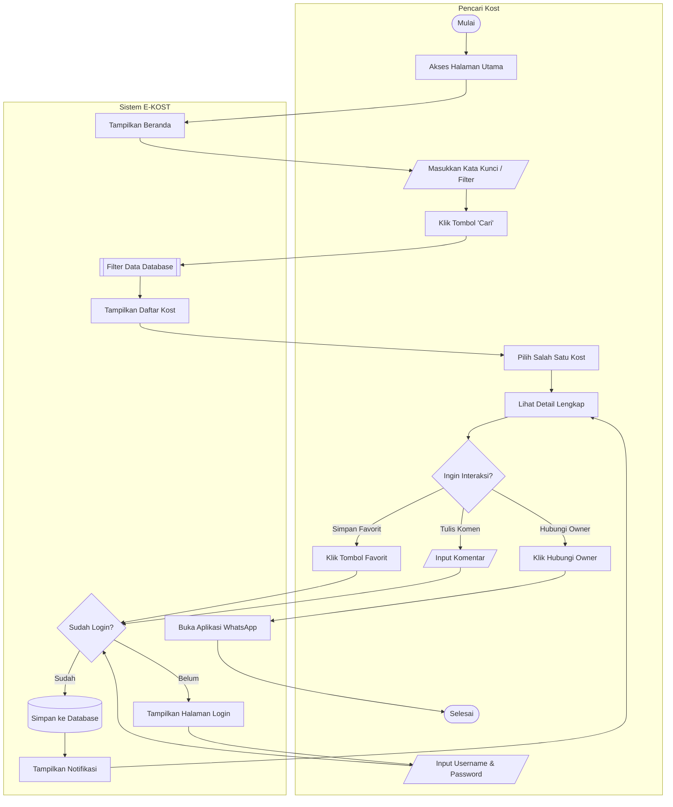
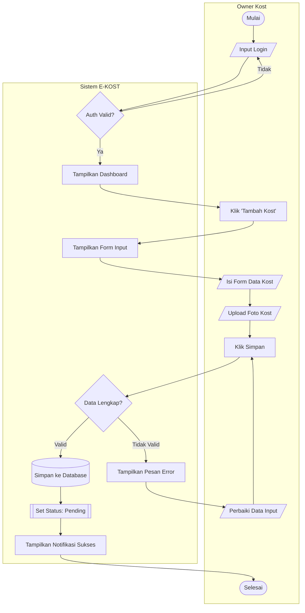
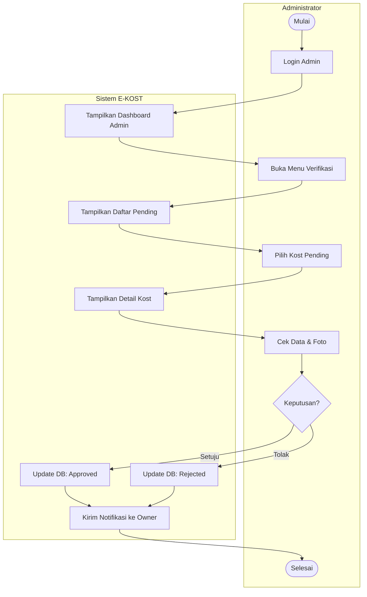
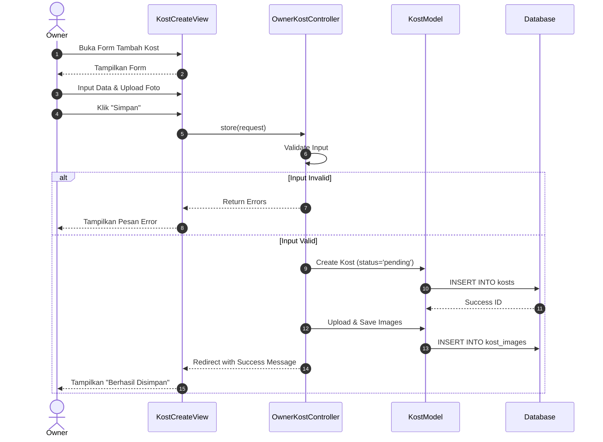
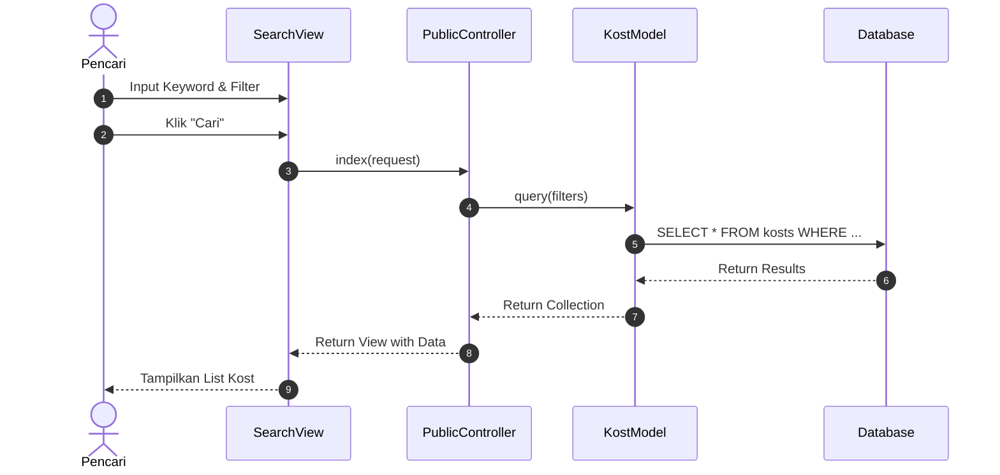

DOKUMEN DESKRIPSI PERANCANGAN PERANGKAT LUNAK
Judul Proyek : Sistem Informasi Pencarian dan Penyewaan Kost (E-KOST)
Studi Kasus: Platform Digital E-KOST
Disusun Oleh:

1. [Nama Anggota 1] (NIM)
2. [Nama Anggota 2] (NIM)
3. [Nama Anggota 3] (NIM)

Tanggal: 16 Desember 2025

---

## 1. PENDAHULUAN

### 1.1 Tujuan Dokumen

Dokumen ini mendeskripsikan perancangan perangkat lunak (_Software Design Document_) untuk Sistem Informasi E-KOST. Dokumen ini berfungsi sebagai panduan teknis yang komprehensif bagi tim pengembang, pemelihara, dan pemangku kepentingan (_stakeholder_) dalam memahami arsitektur, desain sistem, logika bisnis, dan implementasi teknis perangkat lunak.

### 1.2 Ruang Lingkup

Sistem E-KOST dirancang untuk mendigitalisasi dan memodernisasi proses pencarian tempat tinggal sementara (kost) serta manajemen properti bagi pemilik kost. Ruang lingkup dokumen ini mencakup:

-   Deskripsi umum sistem E-KOST sebagai platform perantara.
-   Arsitektur perangkat lunak berbasis web dengan pola Desain MVC (_Model-View-Controller_).
-   Desain rinci modul-modul utama: Autentikasi Multi-User, Manajemen Kost, Pencarian Cerdas, dan Verifikasi Admin.
-   Deskripsi struktur basis data (_Database Design_) mencakup ERD dan Skema Tabel.
-   Alur proses bisnis yang digambarkan melalui Diagram Use Case dan Diagram Aktivitas.
-   Protokol keamanan data dan implementasi kode.
-   Rencana pengujian dan penerapan (_Deployment_).

### 1.3 Definisi dan Akronim

-   **E-KOST**: Nama sistem aplikasi yang dikembangkan.
-   **Owner Kost**: Pengguna yang memiliki properti dan menawarkan kamar kost.
-   **Pencari Kost**: Pengguna (Mahasiswa/Umum) yang mencari tempat tinggal.
-   **Admin**: Pengurus sistem yang memiliki hak akses validasi dan moderasi.
-   **Framework**: Kerangka kerja perangkat lunak (dalam hal ini Laravel).
-   **MVC**: _Model-View-Controller_, pola arsitektur pemisahan logika dan tampilan.
-   **ERD**: _Entity Relationship Diagram_, model visual relasi data.
-   **CRUD**: operasi _Create, Read, Update, Delete_.

### 1.4 Referensi

-   Dokumen Spesifikasi Kebutuhan Perangkat Lunak (SKPL/SRS) Sistem E-KOST.
-   Standar IEEE Std 1016 untuk Deskripsi Desain Perangkat Lunak.
-   Dokumentasi Resmi Framework Laravel 10.x.
-   Hasil Analisis Kebutuhan Pengguna E-KOST.

---

## 2. LANDASAN TEORI

### 2.1 Konsep Dasar Sistem Informasi

Sistem informasi adalah kombinasi dari teknologi informasi dan aktivitas orang yang menggunakan teknologi itu untuk mendukung operasi dan manajemen. E-KOST menerapkan konsep ini dengan mengintegrasikan basis data terpusat dan antarmuka web interaktif untuk memecahkan masalah inefisiensi dalam pasar penyewaan kost konvensional.

### 2.2 Framework Laravel

Laravel adalah kerangka kerja aplikasi web berbasis PHP yang ekspresif dan elegan. Laravel mengikuti pola arsitektur MVC yang memisahkan logika aplikasi (Controller) dari antarmuka pengguna (View) dan struktur data (Model).
Keunggulan Laravel dalam proyek ini:

-   **Eloquent ORM**: Memudahkan manipulasi database dengan sintaks berorientasi objek.
-   **Blade Templating**: Mesin template yang kuat untuk membangun UI dinamis.
-   **Middleware**: Mekanisme filter HTTP yang efisien untuk manajemen hak akses (Role-Based Access Control).

### 2.3 Basis Data MySQL

MySQL adalah sistem manajemen basis data relasional (_RDBMS_) yang digunakan sebagai penyimpanan data utama. MySQL dipilih karena keandalannya, kecepatan, dan dukungan komunitas yang luas, serta integrasi yang sangat baik dengan PHP dan Laravel.

### 2.4 UML (Unified Modeling Language)

UML adalah himpunan struktur dan teknik untuk pemodelan desain program berorientasi objek.

-   **Use Case Diagram**: Memodelkan fungsionalitas sistem dari sudut pandang interaksi pengguna.
-   **Activity Diagram**: Memodelkan alur kerja (_workflow_) prosedural dari logika bisnis sistem.
-   **Class Diagram**: Memodelkan struktur statis kelas-kelas dalam sistem dan hubungannya.

### 2.5 Pengujian Black Box

_Black Box Testing_ adalah metode pengujian perangkat lunak di mana fungsionalitas diuji tanpa mengetahui struktur kode internal. Pengujian ini berfokus pada apakah input pengguna menghasilkan output yang diharapkan sesuai spesifikasi kebutuhan.

---

## 3. DESKRIPSI SISTEM SECARA UMUM

### 3.1 Visi dan Misi Sistem

**Visi**: Menjadi platform digital terdepan yang menghubungkan pencari dan pemilik kost dengan ekosistem yang aman, transparan, dan mudah digunakan.
**Misi**:

-   Menyediakan data kost yang akurat, lengkap dengan foto berkualitas dan detail fasilitas.
-   Memberdayakan pemilik kost dengan alat manajemen properti yang efisien.
-   Menjamin keamanan transaksi informasi melalui verifikasi ketat oleh admin.

### 3.2 Fitur-Fitur Utama Sistem

1.  **Pencarian & Filter Canggih**: Mencari kost berdasarkan Lokasi, Rentang Harga (Min-Max), Tipe (Putra/Putri), dan Fasilitas.
2.  **Manajemen Kost Mandiri**: Owner dapat menambah, mengedit, dan menghapus listing kost serta mengelola ketersediaan kamar.
3.  **Galeri Foto**: Upload multiple foto untuk memberikan gambaran visual yang jelas kepada pencari.
4.  **Verifikasi Listing**: Fitur khusus Admin untuk meninjau dan menyetujui listing sebelum tayang publik.
5.  **Interaksi Sosial**: Fitur Favorit untuk menyimpan kost impian dan Komentar untuk tanya jawab.
6.  **Dashboard Monitoring**: Statistik ringkas jumlah kost bagi Owner dan Admin.

### 3.3 Target Pengguna

-   **Pencari Kost**: Mahasiswa baru, karyawan, atau masyarakat umum yang membutuhkan hunian sementara.
-   **Pemilik Kost (Owner)**: Individu atau badan usaha yang menyewakan kamar kost.
-   **Administrator**: Tim pengelola aplikasi E-KOST.

### 3.4 Lingkungan Operasional

-   **Server**: Web Server Apache / Nginx (Kompatibel dengan XAMPP lokal).
-   **Database**: MySQL 5.7 atau lebih baru.
-   **Bahasa Pemrograman**: PHP 8.1+ (Support Laravel 10).
-   **Browser Client**: Google Chrome, Mozilla Firefox, Safari, Microsoft Edge (Versi Modern).

---

## 4. ARSITEKTUR PERANGKAT LUNAK

### 4.1 Arsitektur Umum

Sistem menggunakan arsitektur aplikasi web standar tiga lapis (_Three-Tier Architecture_):

1.  **Presentation Layer (Frontend)**: Antarmuka pengguna berbasis Web menggunakan HTML5, CSS3, dan Blade Templates.
2.  **Application Layer (Backend)**: Logika pemrosesan bisnis menggunakan PHP dengan Framework Laravel.
3.  **Data Layer (Database)**: Penyimpanan persisten menggunakan MySQL RDBMS.

### 4.2 Pola Arsitektur (MVC)

Sistem mengadopsi pola MVC untuk modularitas:

-   **Model**: (`app/Models`) Menangani struktur data dan logika bisnis database. Contoh: `User`, `Kost`, `Facility`.
-   **View**: (`resources/views`) Menangani presentasi data ke user. Contoh: `kost/index.blade.php`, `owner/dashboard.blade.php`.
-   **Controller**: (`app/Http/Controllers`) Menangani request, memproses input, dan memanggil Model/View. Contoh: `KostController`, `AdminController`.

### 4.3 Komponen Utama Sistem (Class Diagram)

_(Disini Anda dapat menyisipkan Gambar Class Diagram)_



Deskripsi Komponen:

-   **AuthController**: Mengelola registrasi dan login user.
-   **PublicController**: Menangani halaman pencarian dan detail publik.
-   **OwnerKostController**: Logika CRUD kost khusus pemilik.
-   **VerificationController**: Logika persetujuan listing oleh admin.
-   **FileHandler**: Service untuk upload dan optimasi gambar.

---

## 5. DESAIN DATABASE

### 5.1 Entity Relationship Diagram (ERD)

_(Disini Anda dapat menyisipkan Gambar ERD)_



### 5.2 Deskripsi Entitas Utama

**1. Tabel Users**
Menyimpan data akun untuk semua role.

-   **Atribut**: `id` (PK), `name`, `email`, `password`, `role` (enum: 'admin','pemilik','mahasiswa'), `no_hp`, `created_at`.

**2. Tabel Kosts**
Menyimpan data properti kost yang didaftarkan.

-   **Atribut**: `id` (PK), `user_id` (FK User), `nama_kost`, `tipe` (putra/putri/campur), `harga`, `deskripsi`, `alamat`, `status_verifikasi` (pending/approved/rejected).

**3. Tabel Kost_Images**
Menyimpan path file foto-foto kost.

-   **Atribut**: `id` (PK), `kost_id` (FK Kost), `path_foto`.

**4. Tabel Facilities**
Master data fasilitas (misal: WiFi, AC, KM Dalam).

-   **Atribut**: `id` (PK), `nama_fasilitas`, `icon`.

**5. Tabel Kost_Facility** (Pivot)
Relasi many-to-many antara Kost dan Fasilitas.

-   **Atribut**: `id` (PK), `kost_id` (FK), `facility_id` (FK).

---

## 6. DESAIN MODUL

### 6.1 Modul Manajemen Kost (Owner)

-   **Tujuan**: Memberikan kontrol penuh kepada pemilik atas properti mereka.
-   **Input**: Form data kost, Upload foto (Max 2MB).
-   **Proses**: Validasi -> Store to DB -> Resize Image -> Attach Relations.
-   **Output**: Data kost tersimpan dengan status 'Pending'.

### 6.2 Modul Pencarian & Filter (Public)

-   **Tujuan**: Membantu user menemukan kost spesifik.
-   **Input**: Keyword string, Range Integer (Harga), Enum (Tipe).
-   **Proses**: `Kost::where('nama', 'like', ...)->whereBetween('harga', ...)->get()`.
-   **Output**: Collection data kost yang sesuai kriteria.

### 6.3 Modul Verifikasi (Admin)

-   **Tujuan**: Quality Control konten.
-   **Input**: ID Kost, Action (Approve/Reject).
-   **Proses**: Update field `status_verifikasi`.
-   **Output**: Status kost berubah, listing muncul/hilang di publik.

---

## 7. DESAIN USER INTERFACE

### 7.1 Konsep dan Prinsip Desain

Menerapkan **User Centered Design (UCD)**.

-   **Simplicity**: Desain bersih, fokus pada konten foto dan harga.
-   **Responsiveness**: Layout adaptif untuk Mobile (Stacked) dan Desktop (Grid).
-   **Consistency**: Penggunaan komponen UI yang seragam (Kartu Kost, Tombol, Modal).

### 7.2 Rancangan Wireframe

_(Disini Anda dapat menyisipkan Gambar Wireframe)_
**[GAMBAR: Wireframe Halaman Utama (Pencarian)]**
**[GAMBAR: Wireframe Halaman Detail Kost]**
**[GAMBAR: Wireframe Dashboard Owner]**

---

## 8. ALUR PROSES BISNIS

### 8.1 Diagram Use Case

_(Disini Anda dapat menyisipkan Gambar Use Case Diagram)_

```mermaid
usecaseDiagram
    actor "Pencari Kost" as Pencari
    actor "Owner Kost" as Owner
    actor "Admin" as Admin

    rectangle "Sistem E-KOST" {
        usecase "Login / Register" as UC_Auth
        usecase "Cari Kost" as UC_Search
        usecase "Lihat Detail Kost" as UC_Detail
        usecase "Kelola Favorit" as UC_Fav
        usecase "Kirim Komentar" as UC_Comment
        usecase "Hubungi Owner" as UC_Contact
        usecase "Kelola Data Kost (CRUD)" as UC_ManageKost
        usecase "Upload Foto Kost" as UC_Upload
        usecase "Verifikasi Kost" as UC_Verif
        usecase "Moderasi Konten" as UC_Mod
    }

    %% Relasi Pencari Kost
    Pencari --> UC_Auth
    Pencari --> UC_Search
    Pencari --> UC_Detail
    Pencari --> UC_Fav
    Pencari --> UC_Comment
    Pencari --> UC_Contact

    %% Relasi Owner Kost
    Owner --> UC_Auth
    Owner --> UC_ManageKost
    Owner --> UC_Upload
    Owner --> UC_Search
    Owner --> UC_Detail
    Owner --> UC_Contact

    %% Relasi Admin
    Admin --> UC_Auth
    Admin --> UC_Verif
    Admin --> UC_Mod
    Admin --> UC_Search
    Admin --> UC_Detail
```

### 8.2 Diagram Aktivitas (Activity Diagram)

Berikut adalah diagram aktivitas detail untuk tiga peran utama:

#### 8.2.1 Diagram Aktivitas: Pencari Kost (Search & Interact)

Alur pencarian kost hingga melakukan interaksi (Favorit/Komentar).

Diagram ini menggambarkan alur pencari kost dalam menemukan dan berinteraksi dengan properti menggunakan format _swimlane_ untuk memisahkan aktivitas User dan Sistem.



#### 8.2.2 Diagram Aktivitas: Owner Kost (Manage Listing)

Alur pemilik menambahkan listing kost baru.

Diagram ini menggambarkan alur pemilik dalam menambahkan listing kost baru dengan _swimlane_.



#### 8.2.3 Diagram Aktivitas: Admin (Verification)

Alur admin memverifikasi listing yang masuk.

Diagram ini menggambarkan alur kerja admin dalam memvalidasi data kost yang masuk dengan _swimlane_.



### 8.3 Diagram Sekuens (Sequence Diagram)

Diagram berikut menunjukkan interaksi antar objek (View, Controller, Model) seiring waktu.

#### A. Sequence Diagram: Pendaftaran Kost Baru (Owner)



#### B. Sequence Diagram: Pencarian Kost (Pencari)



---

## 9. KEAMANAN & AUTENTIKASI

### 9.1 Mekanisme Hashing Password

Sistem tidak menyimpan password dalam bentuk _plain text_. Menggunakan **Bcrypt** hashing yang disediakan oleh Laravel.
**Implementasi Kode:**

```php
// Contoh pada Controller Register
use Illuminate\Support\Facades\Hash;

$user = User::create([
    'name' => $request->name,
    'email' => $request->email,
    'password' => Hash::make($request->password), // Password di-hash otomatis
    'role' => 'pemilik'
]);
```

### 9.2 Pencegahan SQL Injection

Menggunakan **Eloquent ORM** yang secara otomatis menggunakan _PDO Parameter Binding_ untuk mencegah injeksi SQL berbahaya. Input pengguna tidak pernah disisipkan langsung ke dalam string query.
**Implementasi Aman:**

```php
// Aman (Menggunakan Binding)
$kosts = Kost::where('harga', '<=', $max_price)->get();
```

### 9.3 Validasi File Upload (Keamanan Media)

Sistem menerapkan validasi ketat pada saat upload foto kost untuk mencegah file berbahaya (_backdoor_).
**Logika Pengamanan:**

1.  **MIME Type Check**: Pastikan file adalah gambar (`image/jpeg`, `image/png`).
2.  **Size Limit**: Maksimal 2MB.
3.  **Renaming**: Mengubah nama file asli menjadi hash acak unik.

```php
$request->validate([
    'foto' => 'required|image|mimes:jpeg,png,jpg|max:2048'
]);

if ($request->hasFile('foto')) {
    $file = $request->file('foto');
    $filename = time() . '_' . $file->hashName(); // Rename file
    $file->storeAs('public/kosts', $filename);
}
```

### 9.4 Role-Based Access Control (RBAC)

Sistem membatasi akses URL menggunakan **Middleware**.

-   User publik tidak bisa akses `/admin/*`.
-   Owner tidak bisa akses fitur Admin.
-   Admin memiliki akses level tertinggi.

---

## 10. PENGUJIAN SISTEM (SYSTEM TESTING)

### 10.1 Metode Pengujian

Menggunakan **Black Box Testing** untuk memvalidasi alur fungsi utama.

### 10.2 Skenario dan Hasil Pengujian

#### 10.2.1 Pengujian Login Owner (Berhasil)

| ID Uji     | Fitur | Skenario                                | Hasil Diharapkan         | Hasil Aktual   | Status    |
| :--------- | :---- | :-------------------------------------- | :----------------------- | :------------- | :-------- |
| **TC-001** | Login | Input email & password owner yang benar | Masuk ke dashboard owner | Berhasil masuk | **VALID** |

#### 10.2.2 Pengujian Tambah Kost (Validasi)

| ID Uji     | Fitur       | Skenario                                | Hasil Diharapkan                     | Hasil Aktual       | Status    |
| :--------- | :---------- | :-------------------------------------- | :----------------------------------- | :----------------- | :-------- |
| **TC-002** | Create Kost | Kosongkan kolom "Nama Kost" lalu Submit | Muncul pesan "Nama Kost wajib diisi" | Pesan error muncul | **VALID** |

#### 10.2.3 Pengujian Cari Kost (Filter)

| ID Uji     | Fitur     | Skenario                 | Hasil Diharapkan                 | Hasil Aktual | Status    |
| :--------- | :-------- | :----------------------- | :------------------------------- | :----------- | :-------- |
| **TC-003** | Pencarian | Filter harga Max 500.000 | Tampil kost dengan harga <= 500k | Data sesuai  | **VALID** |

#### 10.2.4 Pengujian Verifikasi Admin

| ID Uji     | Fitur      | Skenario                               | Hasil Diharapkan                   | Hasil Aktual   | Status    |
| :--------- | :--------- | :------------------------------------- | :--------------------------------- | :------------- | :-------- |
| **TC-004** | Verifikasi | Admin klik "Approve" pada kost pending | Status database berubah 'approved' | Status berubah | **VALID** |

---

## 11. DEPLOYMENT & MAINTENANCE

### 11.1 Arsitektur Lingkungan Produksi

Sistem di-deploy pada arsitektur server berbasis awan (_Cloud VPS_) atau _Shared Hosting_.

-   **Web Server**: Nginx (Reversed Proxy) atau Apache.
-   **App Server**: PHP-FPM 8.1.
-   **Database**: MySQL Server.

### 11.2 Prosedur Instalasi (Server/Localhost)

1.  **Clone Source Code**: `git clone https://github.com/username/e-kost.git`
2.  **Install Library**: `composer install` (Backend) & `npm install` (Frontend).
3.  **Konfigurasi Environment**:
    -   Copy `.env.example` ke `.env`.
    -   Set `DB_DATABASE`, `DB_USERNAME`, `DB_PASSWORD`.
4.  **Generate Key**: `php artisan key:generate`.
5.  **Migrasi Database**: `php artisan migrate --seed`.
6.  **Create Storage Link**: `php artisan storage:link`.
7.  **Run Server**: `php artisan serve`.

### 11.3 Rencana Pemeliharaan

-   **Backup Rutin**: Ekspor database mysqldump setiap minggu.
-   **Log Monitoring**: Memantau `storage/logs/laravel.log` untuk error sistem.
-   **Update Security**: Melakukan `composer update` berkala untuk patch keamanan framework.

---

## 12. GLOSARIUM DALAM LAPORAN

-   **Back-End**: Sisi server aplikasi yang menangani logika dan database.
-   **Front-End**: Sisi klien aplikasi yang dilihat pengguna (UI).
-   **Middleware**: Lapisan penengah yang memfilter request HTTP masuk.
-   **Migration**: Fitur Laravel untuk mengelola versi struktur database.
-   **Factory/Seeder**: Alat untuk membuat data palsu (_dummy_) guna pengujian.

---

## 13. LAMPIRAN

### Lampiran A: Skema Database (SQL Representation)

Berikut adalah representasi SQL dari struktur database yang telah diimplementasikan via Laravel Migrations:

```sql
-- Tabel Users
CREATE TABLE users (
    id BIGINT UNSIGNED AUTO_INCREMENT PRIMARY KEY,
    name VARCHAR(255) NOT NULL,
    email VARCHAR(255) UNIQUE NOT NULL,
    password VARCHAR(255) NOT NULL,
    role ENUM('mahasiswa', 'pemilik', 'admin') DEFAULT 'mahasiswa',
    no_hp VARCHAR(20) NULL,
    avatar VARCHAR(255) NULL,
    created_at TIMESTAMP NULL,
    updated_at TIMESTAMP NULL
);

-- Tabel Kosts
CREATE TABLE kosts (
    id BIGINT UNSIGNED AUTO_INCREMENT PRIMARY KEY,
    user_id BIGINT UNSIGNED NOT NULL,
    nama_kost VARCHAR(255) NOT NULL,
    slug VARCHAR(255) UNIQUE NOT NULL,
    tipe ENUM('putra', 'putri', 'campur') NOT NULL,
    harga_per_bulan DECIMAL(12, 2) NOT NULL,
    deskripsi TEXT NOT NULL,
    alamat_lengkap TEXT NOT NULL,
    kota VARCHAR(255) NOT NULL,
    provinsi VARCHAR(255) NOT NULL,
    status_verifikasi ENUM('pending', 'approved', 'rejected') DEFAULT 'pending',
    FOREIGN KEY (user_id) REFERENCES users(id) ON DELETE CASCADE
);

-- Tabel Facilities & Kost_Facility (Many-to-Many)
CREATE TABLE facilities (
    id BIGINT UNSIGNED AUTO_INCREMENT PRIMARY KEY,
    nama_fasilitas VARCHAR(255) NOT NULL,
    icon VARCHAR(255) NULL
);

CREATE TABLE kost_facility (
    id BIGINT UNSIGNED AUTO_INCREMENT PRIMARY KEY,
    kost_id BIGINT UNSIGNED NOT NULL,
    facility_id BIGINT UNSIGNED NOT NULL,
    FOREIGN KEY (kost_id) REFERENCES kosts(id) ON DELETE CASCADE,
    FOREIGN KEY (facility_id) REFERENCES facilities(id) ON DELETE CASCADE
);

-- Tabel Interaksi (Favorites & Comments)
CREATE TABLE favorites (
    id BIGINT UNSIGNED AUTO_INCREMENT PRIMARY KEY,
    user_id BIGINT UNSIGNED NOT NULL,
    kost_id BIGINT UNSIGNED NOT NULL,
    FOREIGN KEY (user_id) REFERENCES users(id) ON DELETE CASCADE,
    FOREIGN KEY (kost_id) REFERENCES kosts(id) ON DELETE CASCADE
);

CREATE TABLE comments (
    id BIGINT UNSIGNED AUTO_INCREMENT PRIMARY KEY,
    user_id BIGINT UNSIGNED NOT NULL,
    kost_id BIGINT UNSIGNED NOT NULL,
    content TEXT NOT NULL,
    parent_id BIGINT UNSIGNED NULL,
    FOREIGN KEY (parent_id) REFERENCES comments(id) ON DELETE CASCADE
);
```

### Lampiran B: Daftar Route Web (Route List)

Daftar endpoint utama yang tersedia dalam aplikasi:

**Public Routes:**

-   `GET /` : Halaman Utama (Pencarian)
-   `GET /kost/{id}` : Detail Kost
-   `GET /fitur` : Info Fitur
-   `GET /login` & `POST /login` : Autentikasi Masuk
-   `GET /register` & `POST /register` : Pendaftaran Akun

**Owner Routes (Role: Pemilik):**

-   `GET /owner/kosts` : Dashboard Daftar Kost
-   `GET /owner/kosts/create` : Form Tambah Kost
-   `POST /owner/kosts` : Simpan Kost Baru
-   `GET /owner/kosts/{id}/edit` : Form Edit Kost
-   `PUT /owner/kosts/{id}` : Update Kost
-   `DELETE /owner/kosts/{id}` : Hapus Kost

**Admin Routes (Role: Admin):**

-   `GET /admin/verification` : Dashboard Verifikasi
-   `POST /admin/verification/{id}/approve` : Setujui Kost
-   `POST /admin/verification/{id}/reject` : Tolak Kost

### Lampiran C: Struktur Direktori Utama

```
E-KOST/
├── app/
│   ├── Http/
│   │   ├── Controllers/    # Logika Bisnis (AuthController, OwnerKostController, dll)
│   │   └── Middleware/     # Filter Akses (RoleMiddleware)
│   └── Models/             # Representasi Data (User, Kost, Facility)
├── database/
│   ├── migrations/         # Definisi Skema Database
│   └── seeders/            # Data Awal (Dummy Data)
├── public/
│   └── storage/            # File Upload (Foto Kost)
├── resources/
│   └── views/              # Antarmuka Pengguna (Blade Templates)
│       ├── auth/           # View Login/Register
│       ├── dashboard/      # View Owner & Admin
│       └── layouts/        # Template Utama
└── routes/
    └── web.php             # Definisi URL/Endpoint
```
