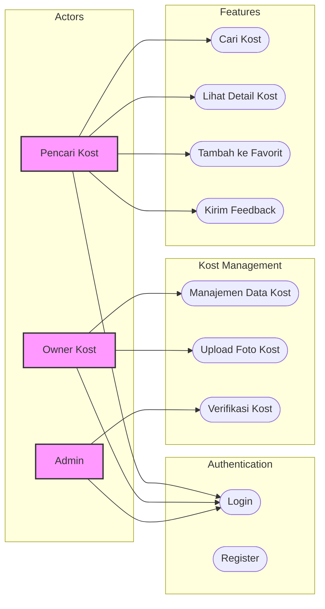
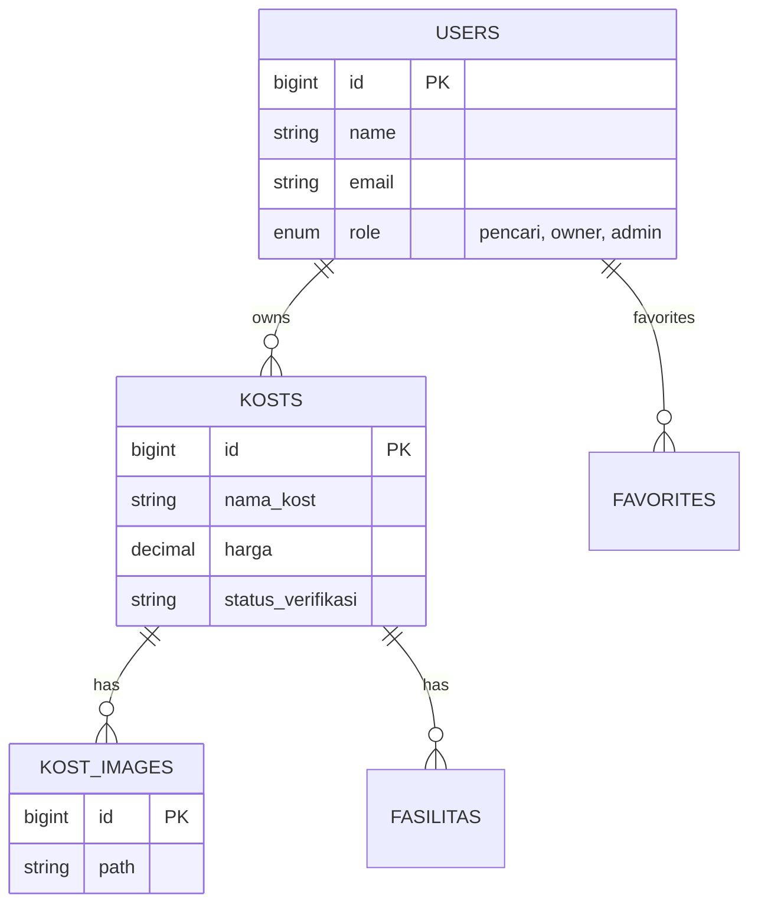
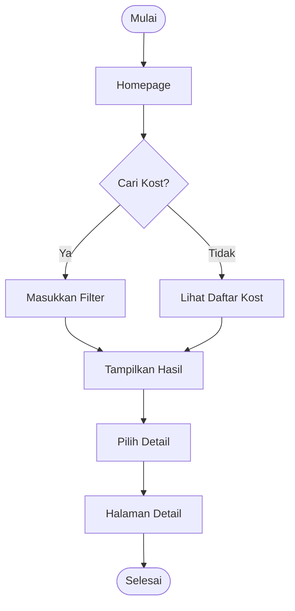

# Deskripsi Perangkat Lunak: E-KOST

## 1. Pendahuluan

### 1.1. Latar Belakang

Pencarian tempat tinggal sementara atau kost seringkali menjadi tantangan bagi mahasiswa maupun masyarakat umum. Metode konvensional mengharuskan pencari kost untuk melakukan survei langsung dari satu lokasi ke lokasi lain, yang memakan waktu dan tenaga. Di sisi lain, pemilik kost sering mengalami kesulitan dalam memasarkan properti mereka secara luas dan mengelola data ketersediaan kamar secara efisien.

"E-KOST" hadir sebagai solusi platform digital modern yang menjembatani kebutuhan antara pencari kost dan pemilik kost secara langsung, tanpa perantara. Sistem ini dirancang guna menciptakan ekosistem pencarian kost yang lebih efektif, transparan, dan mudah diakses.

### 1.2. Tujuan

Tujuan utama dari pengembangan aplikasi E-KOST adalah:

1.  **Mempermudah Pencarian:** Membantu pencari kost menemukan tempat tinggal yang sesuai dengan preferensi mereka (lokasi, harga, fasilitas) melalui fitur pencarian cerdas.
2.  **Pemasaran Efektif:** Menyediakan platform bagi pemilik kost untuk mempromosikan properti mereka dengan jangkauan yang lebih luas.
3.  **Transparansi Informasi:** Memberikan informasi yang detail dan transparan mengenai kondisi kost (termasuk foto dan fasilitas) kepada calon penghuni.
4.  **Manajemen Efisien:** Menyederhanakan proses manajemen data kost bagi pemilik melalui dashboard khusus.
5.  **Keamanan & Interaksi:** Menciptakan interaksi langsung yang aman antara pencari dan pemilik kost.

### 1.3. Manfaat

Aplikasi ini memberikan manfaat bagi berbagai pihak:

-   **Bagi Pencari Kost (Mahasiswa/Umum):**
    -   Menghemat waktu dan biaya survei lokasi.
    -   Mendapatkan informasi akurat dan lengkap (foto, harga, fasilitas) sebelum berkunjung.
    -   Kemudahan menyimpan daftar kost impian (fitur Favorit).
    -   Akses kontak langsung ke pemilik kost.
-   **Bagi Pemilik Kost:**
    -   Pemasaran yang lebih efektif dan efisien tanpa biaya iklan mahal.
    -   Kemudahan mengelola data kost (tambah, ubah, hapus) kapan saja.
    -   Meningkatkan potensi keterisian kamar kost.
-   **Bagi Admin/Pengelola Sistem:**
    -   Memiliki kontrol terhadap kualitas listing yang tampil di aplikasi melalui proses verifikasi.
    -   Mendapatkan masukan (feedback) dari pengguna untuk pengembangan sistem lebih lanjut.

---

## 2. Deskripsi Umum Sistem

### 2.1. Perspektif Produk

E-KOST adalah aplikasi berbasis web yang menghubungkan tiga entitas utama: penyedia kost (Owner), pencari kost (User), dan pengelola platform (Admin). Sistem ini menyediakan antarmuka untuk manajemen properti, pencarian berbasis filter, dan moderasi konten.

### 2.2. Karakteristik Pengguna

| Kategori Pengguna | Deskripsi                                                   | Hak Akses Utama                                                |
| :---------------- | :---------------------------------------------------------- | :------------------------------------------------------------- |
| **Pencari Kost**  | Mahasiswa atau masyarakat umum yang mencari tempat tinggal. | Cari kost, lihat detail, simpan favorit, kirim feedback.       |
| **Owner Kost**    | Perorangan yang memiliki properti kost untuk disewakan.     | Kelola data kost (CRUD), upload foto, lihat status verifikasi. |
| **Admin**         | Pengelola sistem E-KOST.                                    | Verifikasi listing kost, moderasi feedback, manajemen user.    |

---

## 3. Kebutuhan Fungsional

### 3.1. Fitur Pencari Kost

1.  **Registrasi & Login:** Pengguna dapat membuat akun personal.
2.  **Pencarian Pintar:** Mencari kost dengan filter lokasi, rentang harga, tipe (Putra/Putri/Campur), dan fasilitas.
3.  **Halaman Detail:** Melihat deskripsi lengkap, galeri foto, fasilitas, dan harga.
4.  **Favorit:** Menandai kost yang diminati untuk dilihat nanti.
5.  **Interaksi:** Memberikan komentar dan melihat kontak pemilik (misal: WhatsApp).
6.  **Feedback:** Mengirimkan masukan kepada pengelola aplikasi.

### 3.2. Fitur Owner Kost

1.  **Dashboard Manajemen:** Pusat kontrol untuk mengelola properti.
2.  **Manajemen Listing:** Menambah listing baru dengan detail lengkap (judul, harga, deskripsi, alamat).
3.  **Manajemen Media:** Mengunggah dan mengatur foto-foto properti.
4.  **Edit & Hapus:** Mengubah informasi properti yang sudah ada atau menghapusnya.
5.  **Status Verifikasi:** Memantau apakah listing disetujui, ditolak, atau masih pending oleh Admin.

### 3.3. Fitur Admin

1.  **Verifikasi Listing:** Memeriksa pengajuan kost baru dan memberikan persetujuan (Approve) atau penolakan (Reject).
2.  **Manajemen Feedback:** Membaca dan mengelola masukan dari pengguna.
3.  **Moderasi Konten:** Menghapus konten yang melanggar aturan penggunaan.

---

## 4. Arsitektur Sistem (System Architecture)

### 4.1. Diagram Use Case

Diagram berikut menggambarkan interaksi antara aktor dengan fitur-fitur utama dalam sistem E-KOST.

### 4.2. Desain Basis Data (ERD)

Struktur data E-KOST dirancang untuk mendukung relasi antara pengguna, properti kost, dan fitur interaktif.

### 4.3. Diagram Alur (Flowchart) - Pencarian Kost

Berikut adalah alur logika untuk pengguna saat mencari kost:

