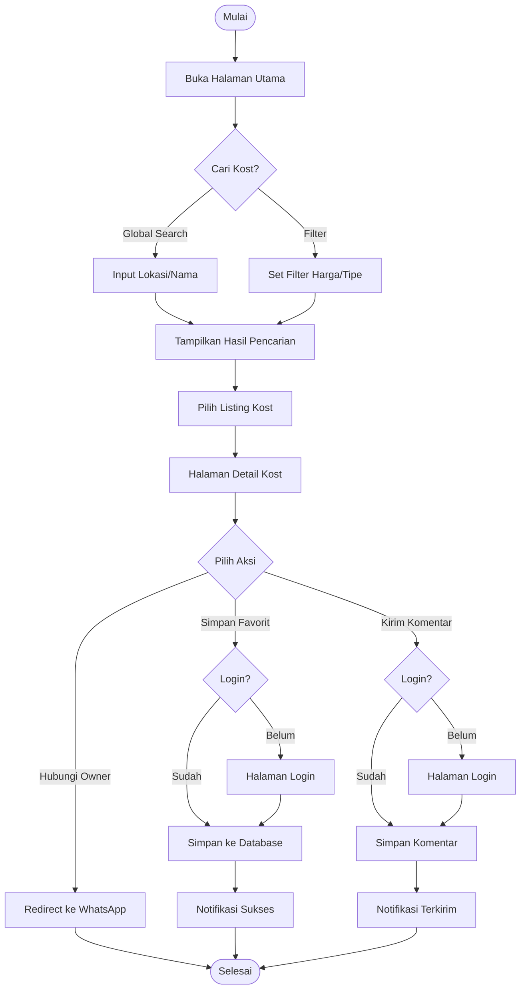
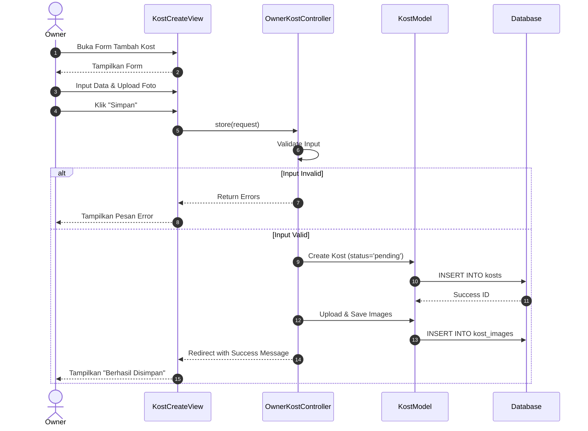
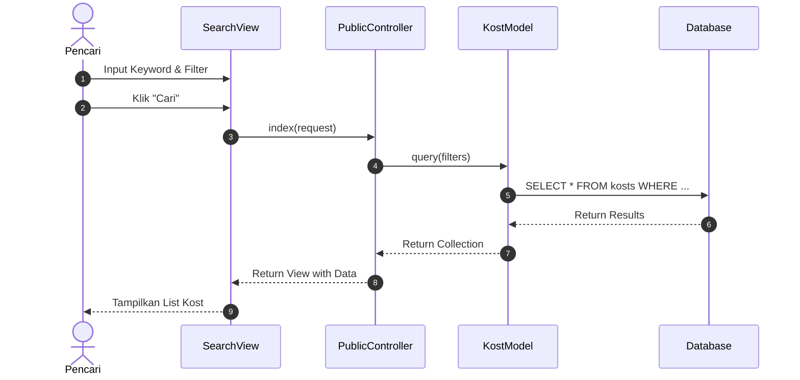
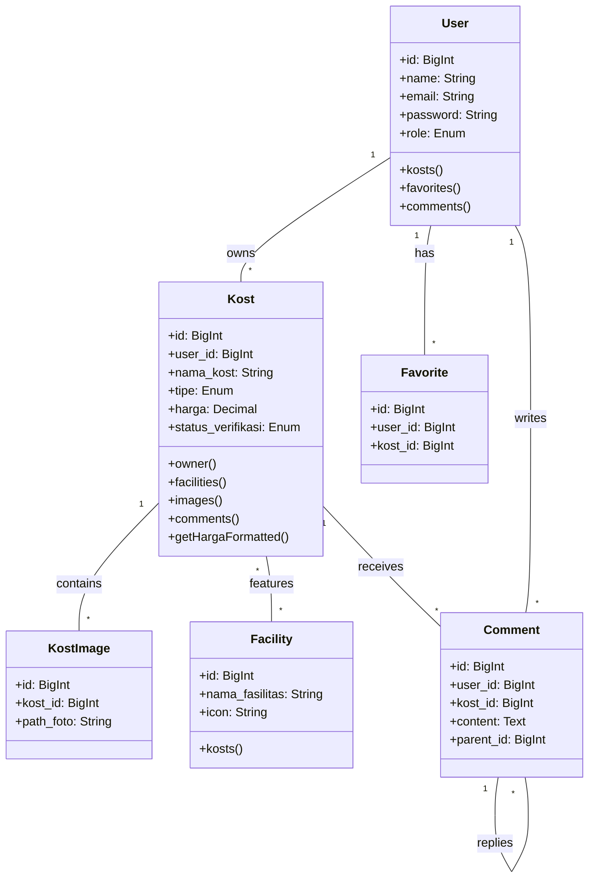
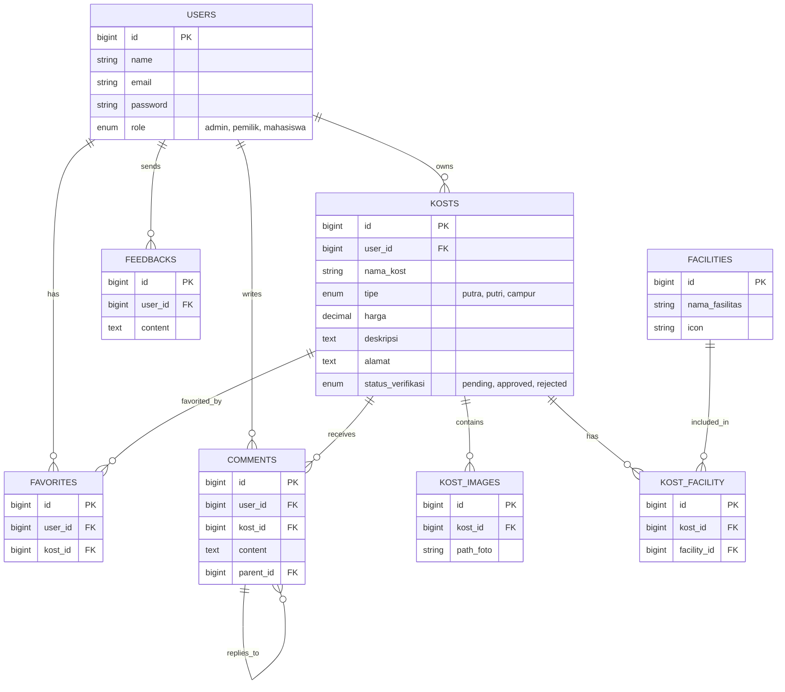

# System Architecture: E-KOST

This document outlines the system architecture for the E-KOST application, visually representing the system's behavior, structure, and data flow using UML diagrams.

## 1. Use Case Diagram

This diagram illustrates the available actions for each role: **Pencari Kost**, **Owner Kost**, and **Admin**.

```mermaid
usecaseDiagram
    actor "Pencari Kost" as Pencari
    actor "Owner Kost" as Owner
    actor "Admin" as Admin

    package "Sistem E-KOST" {
        usecase "Login / Register" as UC_Auth
        usecase "Cari Kost" as UC_Search
        usecase "Lihat Detail Kost" as UC_Detail
        usecase "Kelola Favorit" as UC_Fav
        usecase "Kirim Komentar" as UC_Comment
        usecase "Hubungi Owner" as UC_Contact

        usecase "Kelola Data Kost (CRUD)" as UC_ManageKost
        usecase "Upload Foto Kost" as UC_Upload

        usecase "Verifikasi Kost" as UC_Verif
        usecase "Moderasi Konten" as UC_Mod
    }

    Pencari --> UC_Auth
    Pencari --> UC_Search
    Pencari --> UC_Detail
    Pencari --> UC_Fav
    Pencari --> UC_Comment
    Pencari --> UC_Contact

    Owner --> UC_Auth
    Owner --> UC_ManageKost
    Owner --> UC_Upload
    Owner --> UC_Search
    Owner --> UC_Detail
    Owner --> UC_Contact

    Admin --> UC_Auth
    Admin --> UC_Verif
    Admin --> UC_Mod
    Admin --> UC_Search
    Admin --> UC_Detail
```

---

## 2. Activity Diagrams

These diagrams describe the workflow of specific processes for each user role.

### A. Activity Diagram: Pencari Kost (Search & Interact)

Alur pencarian kost hingga melakukan interaksi (Favorit/Komentar).



### B. Activity Diagram: Owner Kost (Manage Listing)

Alur pemilik menambahkan listing kost baru.

```mermaid
flowchart TD
    Start([Mulai]) --> Login[Login Owner]
    Login --> Dashboard[Dashboard Owner]
    Dashboard --> ClickAdd[Klik "Tambah Kost"]
    ClickAdd --> FormKost[Isi Form Data Kost\n(Nama, Harga, Fasilitas, dll)]
    FormKost --> UploadImg[Upload Foto Kost]
    UploadImg --> Valid{Validasi Input?}

    Valid -- "Gagal" --> ShowError[Tampilkan Error]
    ShowError --> FormKost

    Valid -- "Sukses" --> SaveDB[Simpan Data & Foto]
    SaveDB --> SetStatus[Set Status: Pending]
    SetStatus --> Notify[Notifikasi: Menunggu Verifikasi]
    Notify --> End([Selesai])
```

### C. Activity Diagram: Admin (Verification)

Alur admin memverifikasi listing yang masuk.

```mermaid
flowchart TD
    Start([Mulai]) --> LoginAd[Login Admin]
    LoginAd --> DashAd[Dashboard Admin]
    DashAd --> ViewPending[Lihat Menu "Verifikasi Kost"]
    ViewPending --> SelectItem[Pilih Kost Pending]
    SelectItem --> Review[Review Foto & Deskripsi]
    Review --> Decision{Keputusan?}

    Decision -- "Approve" --> SetApprove[Update Status: Approved]
    Decision -- "Reject" --> SetReject[Update Status: Rejected]

    SetApprove --> NotifyOwner1[Email Pemberitahuan Tayang]
    SetReject --> NotifyOwner2[Email Pemberitahuan Penolakan]

    NotifyOwner1 --> End([Selesai])
    NotifyOwner2 --> End
```

---

## 3. Sequence Diagrams

These diagrams show the interaction between objects (View, Controller, Model) over time.

### A. Sequence Diagram: Pendaftaran Kost Baru (Owner)



### B. Sequence Diagram: Pencarian Kost (Pencari)



---

## 4. Class Diagram

This diagram represents the static structure of the system's classes and their relationships.



---

## 5. Entity Relationship Diagram (ERD)

This diagram shows the database schema structure.


