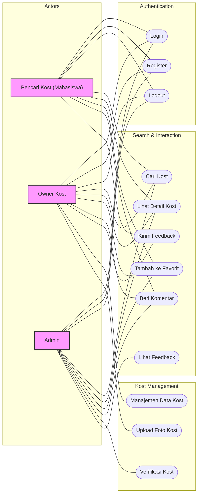
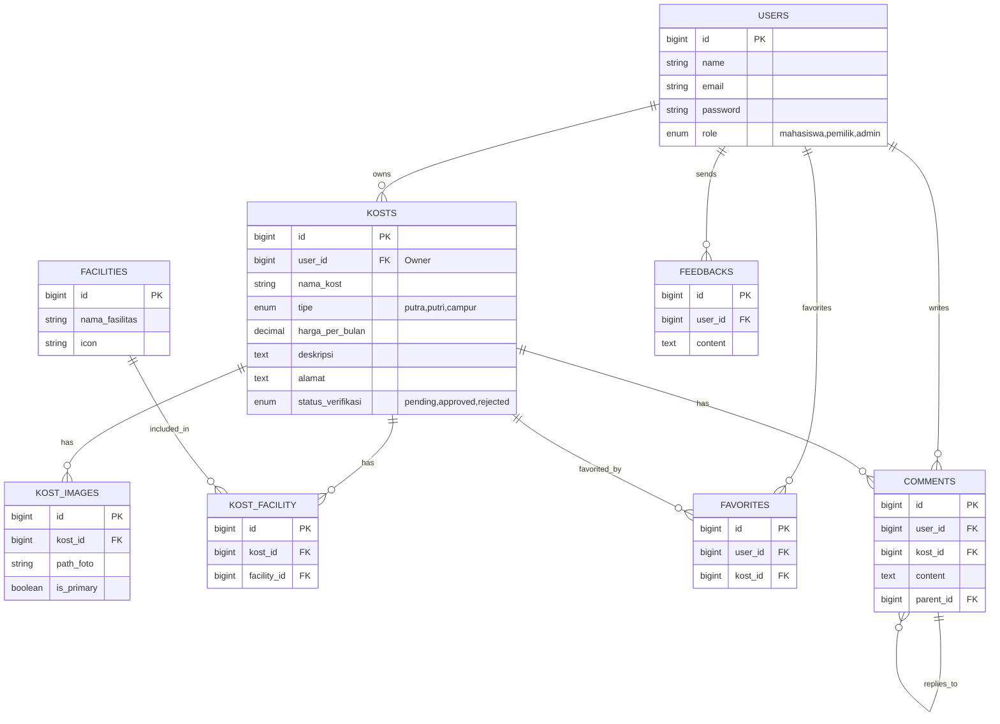
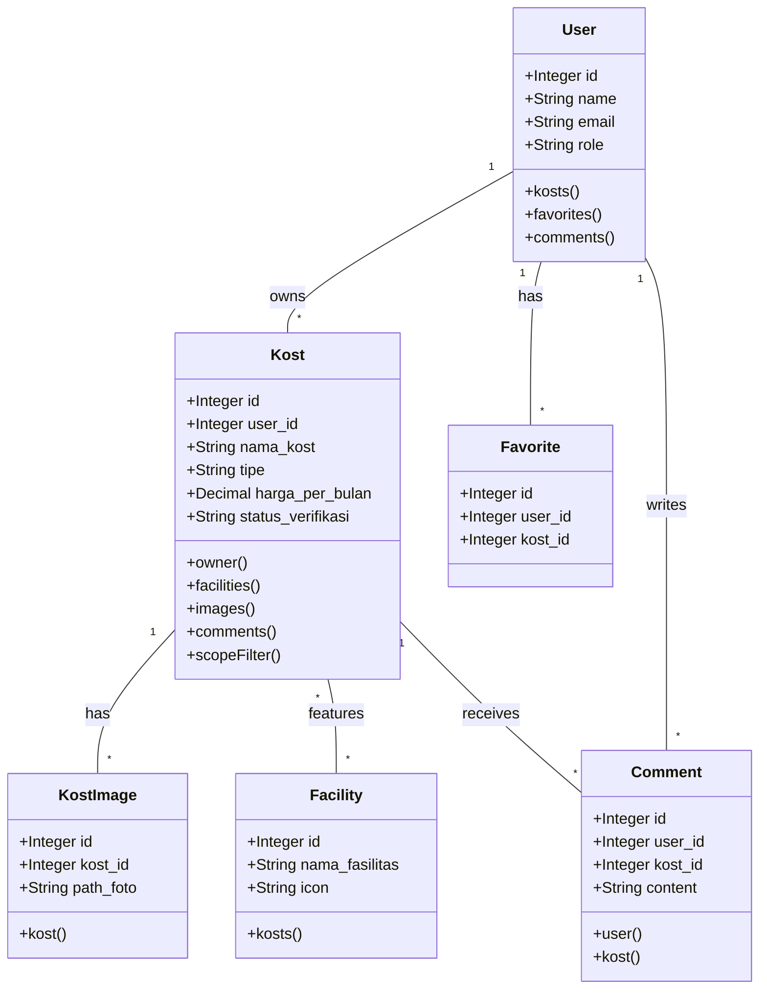
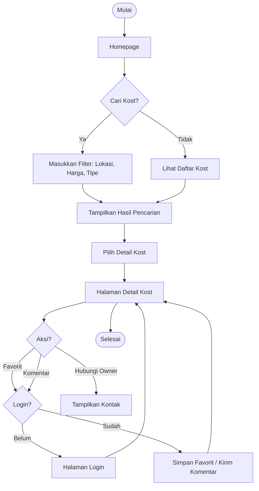
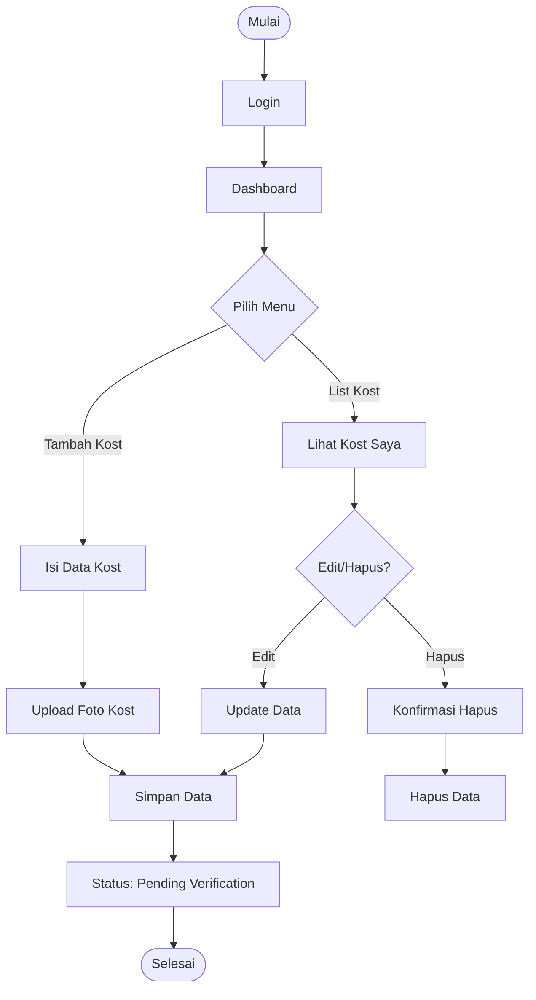
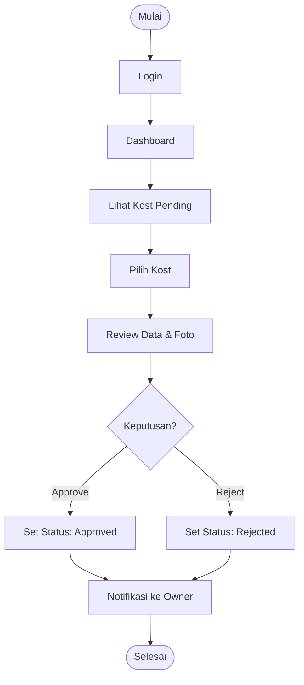

# System Architecture: E-KOST

This document outlines the system architecture for the E-KOST application, categorizing functionalities by role and illustrating the data and logic flows.

## 1. Use Case Diagram

This diagram illustrates the available actions for each role: **Pencari Kost**, **Owner Kost**, and **Admin**.

## 2. Entity Relationship Diagram (ERD)

This diagram shows the database structure and relationships between entities.

## 3. Class Diagram

This diagram represents the Model structure in logical code classes.

## 4. Flowcharts (Diagram Alur)

### A. Role: Pencari Kost (Mahasiswa)

Flow for searching and viewing kost details.

### B. Role: Owner Kost

Flow for managing kost data.

### C. Role: Admin

Flow for verifying kost listings.

